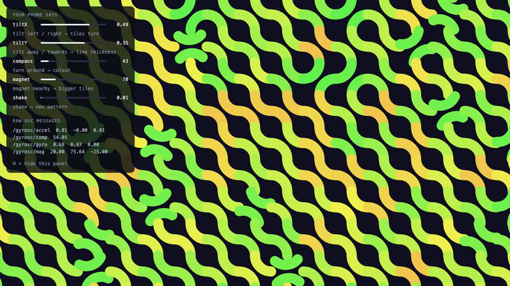

# Phone → OSC → art

Your phone is full of sensors. This tiny app shows how to stream them into
your own code and draw with them: tilt, turn or shake the phone and a pattern
of Truchet tiles changes on your computer screen.



```
phone  ──OSC messages over Wi-Fi──▶  app.py  ──▶  web page (sketch.js draws)
```

**OSC** (Open Sound Control) is a simple way to send numbers over a network.
A message is just a name plus some numbers, for example
`/gyrosc/gyro  0.12  -0.40  1.57`.

## 1. Start the app

You need Python 3. In a terminal:

```
git clone https://github.com/viktor-kertanov/osc_app.git
cd osc_app
python3 -m venv env
source env/bin/activate          (on Windows:  env\Scripts\activate)
pip install -r requirements.txt
python app.py
```

Open <http://localhost:8000> in your browser. You see the tiles and a small
panel that says "Waiting for your phone…".

## 2. Connect your phone

The phone and the computer must be on the **same Wi-Fi**. When `app.py`
starts, it prints the IP address and the port to type into the phone app
(the page shows them too).

**iPhone: [GyrOSC](https://apps.apple.com/app/gyrosc/id418751595)**

1. Set the target IP address to the one `app.py` printed, and the port to `9000`.
2. Switch on these sensors: gyroscope, accelerometer, compass, magnetic field.

**Android: [Sensors2OSC](https://f-droid.org/packages/org.sensors2.osc/)** (free, from F-Droid)

1. In the settings, set the host to the IP address `app.py` printed, and the port to `9000`.
2. Switch on: accelerometer, magnetic field, orientation. Start sending.

**No phone?** Open a second terminal and run a pretend one:

```
source env/bin/activate
python fake_phone.py
```

## 3. Play

| Do this with the phone | Number in the code | What changes |
| --- | --- | --- |
| Tilt left / right | `phone.tiltX` (-1 … 1) | tiles turn |
| Tilt away / towards you | `phone.tiltY` (-1 … 1) | line thickness |
| Turn around | `phone.compass` (0 … 360) | colour |
| Hold it near a magnet | `phone.magnet` (about 50, up to hundreds) | tile size |
| Shake it | `phone.shake` (0 … 1) | new pattern |

Press **H** to hide the panel.

## 4. Make it your own

Open `static/sketch.js`. Near the top there are a few lines that connect the
phone to the picture:

```js
const turned    = map(phone.tiltX, -0.7, 0.7, -0.05, 1.05);
const thickness = map(phone.tiltY, -0.7, 0.7, 0.06, 0.4);
const colour    = phone.compass;
const size      = map(phone.magnet, 30, 300, 60, 200);
```

Change them, save, and reload the page (no need to restart `app.py`). Some ideas:

- Swap them: let the compass set the tile size and the magnet the colour.
- Draw something else than arcs inside each tile: lines, dots, letters.
- Replace the whole drawing with your own. The only thing you need is the
  `phone` object.

Every message the phone sends is also in `phone.raw`, exactly as it arrived,
for example `phone.raw['/gyrosc/gyro']`. The panel on the page lists them all.

## The files

| File | What it does |
| --- | --- |
| `app.py` | Catches the OSC messages and passes them to the web page. |
| `static/phone.js` | Asks `app.py` for the newest messages and turns them into the easy `phone` numbers. |
| `static/sketch.js` | Draws the tiles. **This is the one to change.** |
| `static/index.html` | The page that holds it all. |
| `fake_phone.py` | Pretends to be a phone. Also shows how to *send* OSC from Python. |

## If it doesn't work

- **Still "Waiting for your phone…"**
  Check that the phone and the computer are on the same Wi-Fi and that the IP
  address and port in the phone app are right. School and guest Wi-Fi often
  stop devices from talking to each other: turn on your phone's hotspot and
  connect the computer to it. If the computer asks whether Python may accept
  incoming connections, say yes.
- **"Address already in use"**
  `app.py` is already running in another terminal. Stop that one with Ctrl+C.
- **A direction feels backwards**
  Put a minus sign in front of that value in `translate()` in `static/phone.js`.
- **You use another OSC app and nothing moves**
  The app works if you can see its messages in the "raw OSC messages" list.
  Every app names its messages differently, so put the names you see there
  into `translate()` in `static/phone.js`.
